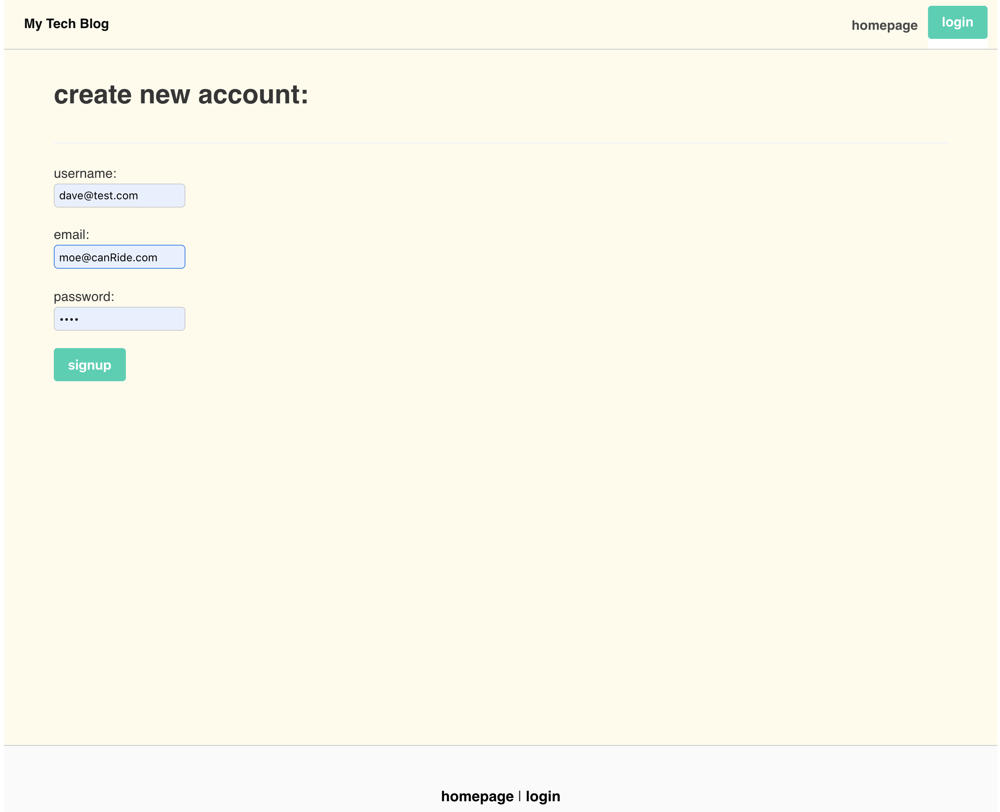
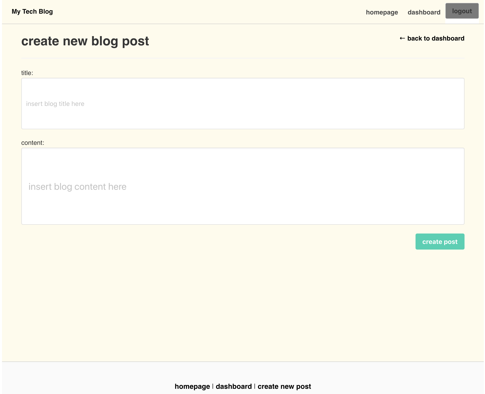
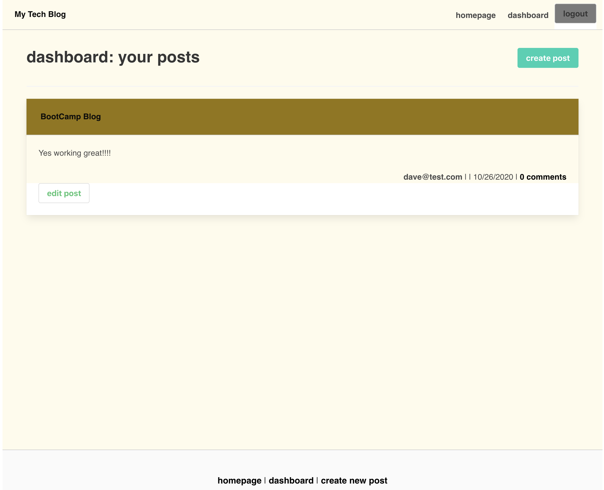
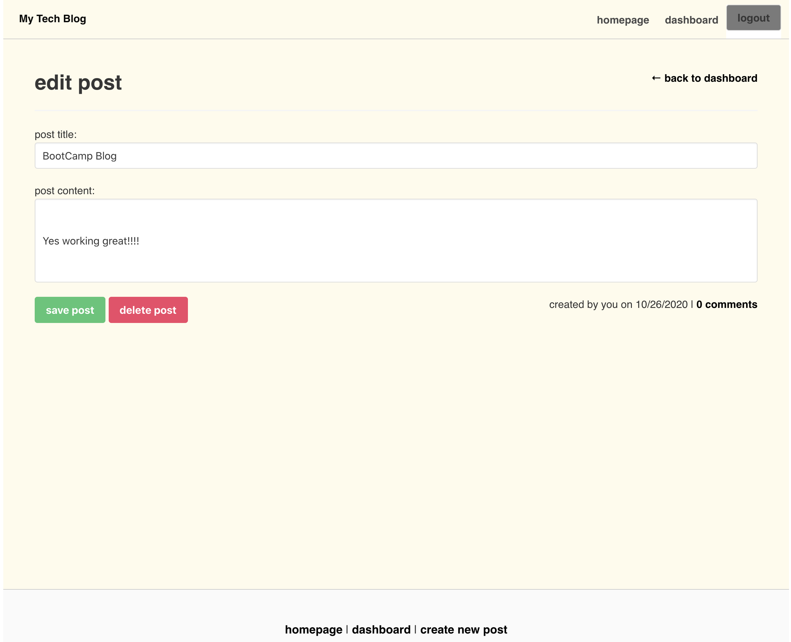
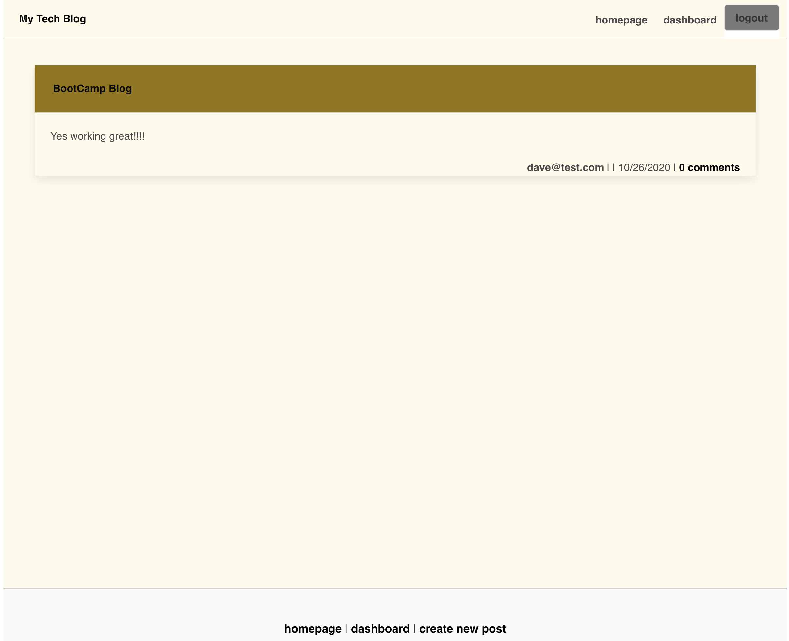

# tech-blog

## Usage

Website Link
Upon opening app you will be presented with the blog website.
You can browse through the entries or you can login/signup.
If you choose to sign-up/login you will asked for login/sign-up details.
Once loggin in you can cotinue on adding a new post or commenting on existing ones.

## Dependencies

```${blackBlink.name}
"bcrypt": "^5.0.0",
"bootstrap": "^4.5.3",
"connect-session-sequelize": "^7.0.4",
"dotenv": "^8.2.0",
"express": "^4.17.1",
"express-handlebars": "^5.2.0",
"express-session": "^1.17.1",
"mysql2": "^2.2.5",
"sequelize": "^6.3.5"
```

## Test command

```${blackBlink.name}
npm test
```

## Installation

```${blackBlink.name}
npm i
```

## languages

```${blackBlink.name}
JAvaScript,ES6,node.js,mvc,sequlize
```


## Screenshot






